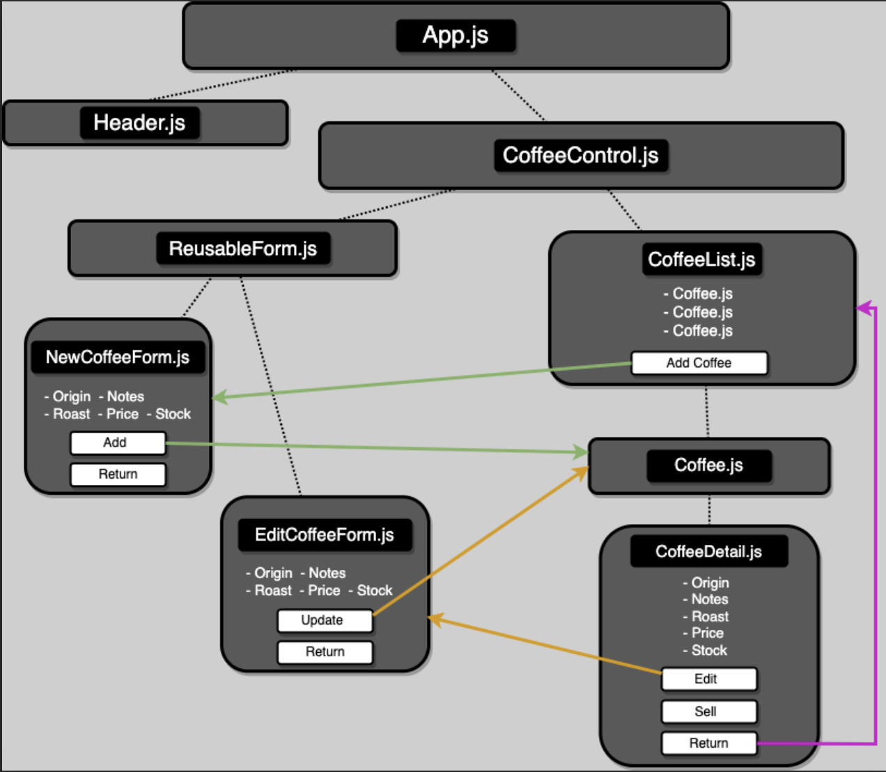

# &#x1F4CB; <span style="font-family: sans-serif; text-shadow: 2px 2px 4px black;">Inventory Tracker</span> &#x1F4CB;

#### by Casey Hill

##### <span style="color: rgb(33, 112, 19); text-shadow: 2px 2px 4px black; font-style: italic;">_...."You can't manage what you can't measure."_ — Peter Drucker</span>

A simple React app that allows a user to track inventory (a coffee bean distributor in this example project).

_This project was bootstrapped with [Create React App](https://github.com/facebook/create-react-app)._

## Technologies Used

-   Git
-   JavaScript
-   JSX
-   React
-   HTML
-   CSS
-   NPM
-   Phosphorus Icons

## Description

This is a simple inventory tracking React web application with Create, Read, and Update functionality. The main page displays a static list of coffee beans. Select the "Add Coffee" button to add a new coffee bean type to the existing list. Click on a product in the list to view its details, and edit the product or "Sell" the product from that view. Navigate to previous menu using the "Return to Coffee List" option.

## Component Diagram



## Setup/Installation Requirements

1. In your terminal, clone this project to your local:

    ```bash
    git clone https://github.com/0art-vandelay0/inventory-tracker
    ```

2. Build & Run Project

    - a. Navigate to the `inventory-tracker` directory you just created.
        ```bash
        cd inventory-tracker
        ```
    - b. install Node package dependencies:
        ```bash
        npm install
        ```
    - c. Bundle/build project and run in browser:
        ```bash
        npm run start
        ```

    Your browser will automatically open to localhost port 3000 and run the application there.

## **Known Bugs**

-   Currently no DELETE functionality to delete products.
-   Currently no option to directly increment stock without using 'Edit'. To add stock: use the 'Edit' option in the details view and adjust the stock as necessary.

## Available Scripts

In the project directory, you can run:

### `npm start` <span style="font-size: 13px; color: rgb(168, 86, 50);">&nbsp; |&nbsp; or &nbsp;| &nbsp;</span> `npm run start`

Runs the app in the development mode.\
Open [http://localhost:3000](http://localhost:3000) to view it in your browser.

The page will reload when you make changes.\
You may also see any lint errors in the console.

### `npm run build`

Builds the app for production to the `build` folder.\
It correctly bundles React in production mode and optimizes the build for the best performance.

The build is minified and the filenames include the hashes.\
Your app is ready to be deployed!

See the section about [deployment](https://facebook.github.io/create-react-app/docs/deployment) for more information.

<details>
<summary>Copyright (c) 2023 Casey Hill</summary>
<br>

**MIT**

Permission is hereby granted, free of charge, to any person obtaining a copy
of this software and associated documentation files (the "Software"), to deal
in the Software without restriction, including without limitation the rights
to use, copy, modify, merge, publish, distribute, sublicense, and/or sell
copies of the Software, and to permit persons to whom the Software is
furnished to do so, subject to the following conditions:

The above copyright notice and this permission notice shall be included in all
copies or substantial portions of the Software.

THE SOFTWARE IS PROVIDED "AS IS", WITHOUT WARRANTY OF ANY KIND, EXPRESS OR
IMPLIED, INCLUDING BUT NOT LIMITED TO THE WARRANTIES OF MERCHANTABILITY,
FITNESS FOR A PARTICULAR PURPOSE AND NONINFRINGEMENT. IN NO EVENT SHALL THE
AUTHORS OR COPYRIGHT HOLDERS BE LIABLE FOR ANY CLAIM, DAMAGES OR OTHER
LIABILITY, WHETHER IN AN ACTION OF CONTRACT, TORT OR OTHERWISE, ARISING FROM,
OUT OF OR IN CONNECTION WITH THE SOFTWARE OR THE USE OR OTHER DEALINGS IN THE
SOFTWARE.

</details>
